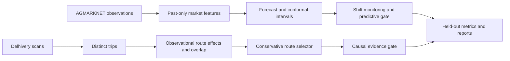

# Reliable Causal Decisions for Supply Chains Under Distribution Shift

Private project repository: https://github.com/AaslinFCR/reliable-causal-supply-chain

M.Tech research implementation based on the supplied project plan. Actual measured results, figures and limitations are generated in `reports/EVALUATION.md`.

## Application: local and cloud

The default website is now an automatic **main-to-regional warehouse crisis monitor** with no data-entry forms. It replays historical observations, computes market-inflow forecasts, simulates regional demand and disruption scenarios, and produces constrained transfer responses and manager alerts. Read [AUTOMATION.md](AUTOMATION.md) for scenario boundaries, alert routing and SMTP setup.

The new `/fulfillment` control tower automatically reserves stock for recorded orders and tracks confirmed dispatch, transit and delivery. It includes a durable shipment handoff queue, cancellations, signed ERPNext order intake and an isolated synthetic demo with replenishment, fuel and strike scenarios. ERPNext and Delhivery accounts are not connected; carrier booking is not active. See [BUSINESS_SETUP.md](BUSINESS_SETUP.md) for data sources, integration contracts and activation requirements.

Warehouse operations at `/operations` include main/regional inventory, receipts, dispatches, atomic transfers, manual demand/fuel/strike records, historical market fluctuation comparisons and saved planning scenarios. Inventory and operational conditions start empty until real manual records are entered. Scenario outputs never execute transfers. GitHub Actions and Render are configured for automatic deployment after CI passes; the private GitHub repository is connected and hosting activation still requires a cloud account.

Run `./start-app.ps1` and open http://127.0.0.1:8000 for the forecast dashboard, model evidence, CSV import and persistent outcome monitoring. See [DEPLOYMENT.md](DEPLOYMENT.md) for Docker and cloud instructions. The local application has been tested. Linux integration tests, the Docker build and production-container health/authentication checks passed in [GitHub Actions](https://github.com/AaslinFCR/reliable-causal-supply-chain/actions/runs/37651745549). Cloud hosting is not connected yet.

The separately frozen deployment model was evaluated on 4,965 newly acquired January–March 2024 observations: WAPE 22.81%, MAE 31.242 tonnes, and 91.94% empirical coverage for 95% nominal intervals. It improves on a rolling mean but underperforms the same-training log-LightGBM baseline. Read [the forward evaluation](reports/DEPLOYMENT_EVALUATION.md) before operational use. Predictive review remains AMBER because coverage is below target; causal interventions remain disabled.

## Complete workflow

The project has an isolated Python 3.12 environment on this computer. Run `./run.ps1` to acquire original data, verify checksums, prepare panels, evaluate models and policies, generate reports, run tests and package the results. Run `./run.ps1 -Offline` to require the downloaded inputs and avoid network requests.

To install on another Windows computer with Python 3.12:

```powershell
python -m venv .venv
./.venv/Scripts/python.exe -m pip install -r requirements-lock.txt
./.venv/Scripts/python.exe -m pip install -e . --no-deps
./run.ps1
```

`reports/pipeline_status.json` records completed stages and any failure. `scripts/verify_reproducibility.py` reruns evaluation and compares numerical artifact checksums. `python run.py scrc.demo` displays historical replay examples. `python run.py scrc.eval.plots` regenerates the report and figures from completed outputs.

## Datasets and provenance

- Original [Government of India AGMARKNET](https://agmarknet.gov.in/) monthly observations: rice, wheat, onion and potato, January 2021–December 2023, Uttar Pradesh. All 144 required state/crop/month responses are retained as compressed originals in `data/raw/official`; URLs, parameters and SHA-256 checksums are recorded in `data/raw/official_manifest.json`. The downloader resumes cached files and respects server rate limits with bounded cooldown retries.
- Delhivery September–October 2018 records from the [public educational dataset mirror](https://github.com/shekshavalipattan/Delhivery-Logistics-Data-Pipeline-and-Feature-Engineering). Repeated scans are aggregated by shipment leg and then trip. The CSV is retained locally in `data/raw/delhivery.csv`.
- Government announcements establish the rice and onion export-policy event dates recorded in `configs/events.yaml`. Event labels are context for descriptive evaluation; they do not establish a causal effect.

Sixteen markets are selected using only January 2021–June 2022 reporting coverage and frozen in `configs/official_markets_up.json`. Training ends June 2022, calibration covers July–December 2022, validation January–June 2023, and test July–December 2023. Missing dates remain missing; source observations are never fabricated. Earlier four-state rice/wheat experiments from 2014–2016 are archived under `runs/archive_2014_2016` and excluded from current official-source results. Partial CEDA responses are also excluded.

The attempted four-state 2021–2023 expansion reached 184/576 files, then continued returning HTTP 429 after extended cooldowns. The primary experiment uses the complete Uttar Pradesh cohort (144/144), excluding incomplete Karnataka files. The India Data Portal data endpoint required a signed-in session. This limits current regional generalization; no four-region validation is claimed for the four-commodity experiment. The full expansion configuration is retained as `configs/full_official_four_states.yaml`; use `python run.py scrc.pipeline --config configs/full_official_four_states.yaml` only when that source becomes available. This reruns and replaces the experiment outputs, so preserve the existing run first.

## Methods and scientific scope



The pipeline includes LightGBM forecasts, finite-sample split conformal intervals, adaptive online intervals, past-only shift scores, threshold selection on validation data, an observational route-effect T-learner, propensity overlap diagnostics, date-cluster bootstrap, placebo and specification checks, conservative policy selection, doubly robust policy scoring and a GREEN/AMBER/RED gate. Baselines and ablations are evaluated on chronological held-out records. The code does not claim arbitrary-shift coverage guarantees.

Arrivals measure market inflow, not demand or inventory. The shortage-pressure indicator is a descriptive proxy, not an observed stock-out. The Delhivery records cannot be linked to the market panel by shipment ID or overlapping period. Unobserved loads and fleet constraints, and potentially post-treatment route measurements, prevent verified causal identification. The operational causal gate therefore rejects automated interventions. Policy results are observational estimates, and action cost zero is an explicit delay-factor scenario. Actual fill rates, stock-out reductions and monetary savings cannot be inferred from these inputs.

## Deliverables

`experiments/` contains measured metrics, replay records, fitted model exports, diagnostics, validation sweeps and experiment hashes. `reports/` contains the generated evaluation, high-resolution scientific figures, tables, a LaTeX experimental setup/results fragment, data cards and completion checklist. Cleaned CSVs are in `data/processed/`. `reliable-causal-supply-chain.zip` contains code, configuration, aggregate results and the archived regional experiment. Raw and processed datasets remain available locally and are excluded from the ZIP because their redistribution terms have not been verified.
